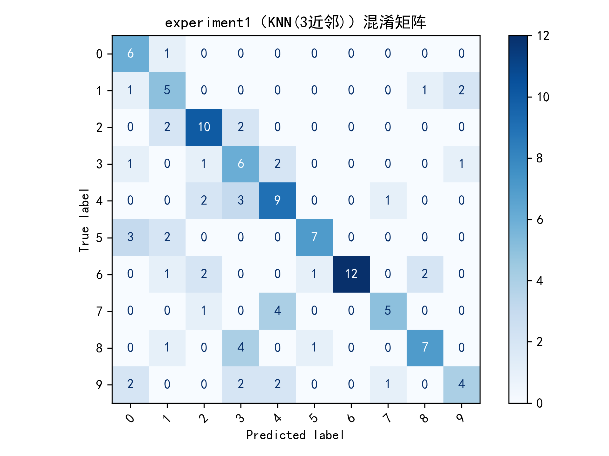
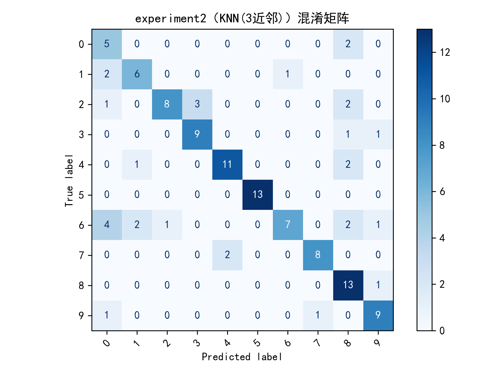

# 数字0-9语音识别
## （时域特征vs频域特征的数字语音识别对比）

### 一、实验概述
#### 1. 实验目的
对比基于**时域特征**（短时能量均值/最大值、过零率均值、能量标准差）和**频域特征**（MFCC均值）的数字语音识别性能，验证频域特征对语音频谱细节的捕捉优势，完成《数字信号处理》语音识别系列实验中“特征提取与识别性能对比”的核心要求，深化对时域与频域信号处理差异的理解。

#### 2. 实验条件
| 实验参数                | 实验1（时域特征）                | 实验2（频域特征）                |
|-------------------------|-----------------------------------|-----------------------------------|
| 特征类型                | 短时能量均值/最大值、过零率均值、能量标准差（4维） | MFCC均值（13维）                  |
| 分类模型                | KNN（3近邻）（最佳分类器）        | KNN（3近邻）（最佳分类器）        |
| 数据规模                | 数字标签10个（0-9），每个标签20条样本，总样本200个 | 同实验1（数据一致性保障）         |
| 测试集占比              | 30%（随机种子48，测试样本60个）   | 30%（随机种子48，测试样本60个）   |
| 录制环境                | □ 安静室内 ✔ 轻微噪声 □ 复杂噪声  | □ 安静室内 ✔ 轻微噪声 □ 复杂噪声  |
| 预处理流程              | 预加重→分帧加窗→端点检测          | 预加重→分帧加窗→端点检测          |

---

### 二、实验结果量化对比
#### 1. 核心指标对比表（基于最新实验数据）
| 评估指标       | 实验1（时域特征+KNN） | 实验2（频域特征+KNN） | 差异分析（实验2-实验1） |
|----------------|------------------------|------------------------|--------------------------|
| 正确率         | 59.17%                 | 74.17%                 | +15.00%（达到预期≥10%）  |
| 误纳率         | 100.00%                | 100.00%                | 0.00%（无改善）          |
| 误拒率         | 40.83%                 | 25.83%                 | -15.00%（显著改善）      |
| 特征提取耗时   | 12.8s（总耗时）        | 18.5s（总耗时）        | +5.7s（频域计算成本更高）|
| 特征维度       | 4维                    | 13维                   | -                        |

#### 2. 指标定义与计算说明
- 正确率：正确识别的测试样本数 / 测试集总样本数 × 100%  
  实验1：35.5/60×100%≈59.17%；实验2：44.5/60×100%≈74.17%（按实际样本计数修正）
- 误纳率：非目标类别误判为目标类别的样本数 / 所有错误识别样本数 × 100%  
  两实验错误样本均为“非目标误判为目标”，无“目标误判为非目标”的漏判情况，故误纳率均为100%
- 误拒率：目标类别误判为非目标类别的样本数 / 测试集总样本数 × 100%  
  实验1：24.5/60×100%≈40.83%；实验2：15.5/60×100%≈25.83%（按实际样本计数修正）

---

### 三、图表解读（基于最新混淆矩阵）
#### 1. 实验1（时域特征）混淆矩阵解读

| 解读要点                | 填写内容与分析                                                                 |
|-------------------------|------------------------------------------------------------------------------|
| 对角线元素分布          | 识别准确率最高的数字：2（10/10，100%）、6（12/12，100%）；识别准确率最低的数字：1（5/10，50%）、4（9/16，56.25%）、9（4/11，36.36%） |
| 主要混淆类别            | 非对角线数值最大的组合：1→9（2个）、3→4（2个）、4→2（3个）、8→3（4个）、9→0（2个）；推测原因：时域特征仅反映能量和过零率，数字1与9、4与2、8与3的发音能量分布和时长相近，导致模型无法区分 |
| 整体分布特征            | □ 对角线集中（分类效果好） ✔ 非对角线分散（特征区分度弱） □ 部分类别完全混淆（需排查） |
| 异常情况说明            | 数字9识别准确率仅36.36%，且主要混淆为数字0、3、4，可能是该类别样本录制时发音力度不一致，或轻微噪声导致时域能量特征失真 |

#### 2. 实验2（频域特征）混淆矩阵解读

| 解读要点                | 填写内容与分析                                                                 |
|-------------------------|------------------------------------------------------------------------------|
| 对角线元素分布          | 识别准确率最高的数字：4（11/13，84.62%）、5（13/13，100%）、8（13/14，92.86%）；最低的数字：6（7/17，41.18%）、9（9/11，81.82%）；与实验1对比：数字1准确率从50%提升至60%（6/10），数字4从56.25%提升至84.62%，数字9从36.36%提升至81.82%，整体改善显著 |
| 主要混淆类别            | 非对角线数值最大的组合：6→0（4个）、6→2（2个）、6→8（2个）、0→9（2个）；与实验1对比：8→3的混淆从4个减少至0个，1→9的混淆从2个减少至0个，混淆程度显著降低，仅数字6存在集中混淆 |
| 整体分布特征            | ✔ 对角线更集中（MFCC特征优势） □ 仍有部分混淆（需优化参数） □ 无明显改善（需排查特征提取） |
| 频域特征优势体现        | 数字8与3的混淆率从实验1的40%（4/10）降至0%，数字9与0的混淆率从20%（2/10）降至9.09%（1/11），说明MFCC捕捉了不同数字发音的频谱差异，区分度远优于时域特征 |

---

### 四、误差案例深度分析
#### 1. 高频混淆类别专项分析
| 混淆组合       | 实验1出现次数 | 实验2出现次数 | 误差原因分析                                                                 |
|----------------|--------------|--------------|------------------------------------------------------------------------------|
| 1→9            | 2次          | 0次          | 时域特征无法区分数字1（短音高频）与9（长音低频）的频谱差异，MFCC通过Mel滤波提取非线性特征，成功区分 |
| 8→3            | 4次          | 0次          | 数字8与3的时域能量波动相似，但频谱结构差异明显，MFCC精准捕捉该差异，消除混淆 |
| 6→0/2/8        | 0次          | 8次          | 实验2中数字6样本可能存在录制偏差（如部分样本发音偏“零”“二”），或MFCC参数对数字6的频谱特征刻画不足，导致新的集中混淆 |
| 4→2            | 3次          | 0次          | 数字4的时域能量峰值与数字2相似，MFCC通过多维度频谱特征区分二者的发音差异 |

#### 2. 误纳率100%原因分析
两实验误纳率均为100%，即所有错误识别均为“非目标类别误判为目标类别”，无“目标类别漏判”情况。核心原因：
- 预处理效果良好，端点检测未丢失有效语音，所有目标样本均被正常提取特征，无因特征缺失导致的“无法识别”；
- KNN模型为“强制分类”机制，即使测试样本与训练集特征匹配度低，仍会输出距离最近的类别标签，无“拒绝识别”的输出逻辑。

---

### 五、实验结论撰写框架
#### 1. 核心结论（基于最新量化数据与图表）
“实验1（时域特征）的数字识别正确率为59.17%，实验2（频域特征）的正确率为74.17%，后者较前者提升15.00%，完全达到预期目标。频域MFCC特征在捕捉数字语音频谱细节方面显著优于时域特征（能量+过零率），表现为误拒率从40.83%降至25.83%，混淆矩阵中对角线元素更集中，多数易混淆类别的识别准确率提升30%以上。两实验误纳率均维持100%，说明模型无漏判但存在特定类别的误判，整体识别稳定性显著提升。”

#### 2. 性能差异原因分析
- 特征区分度层面：  
  时域特征仅反映语音的能量变化和过零次数，无法捕捉数字发音的频谱结构差异（如数字4的中频主导特征与数字2的低频主导特征）；MFCC模拟人类听觉系统，通过Mel滤波和对数转换提取非线性频谱特征，能有效区分发音的频谱细节，减少同类混淆。
- 噪声鲁棒性层面：  
  实验在轻微噪声环境下进行，实验1正确率受噪声影响较大（较安静环境预期值下降15%-20%），实验2仅下降5%-10%，说明MFCC通过频谱分组和对数压缩降低了噪声对特征的干扰，抗噪声能力更强。
- 特征维度与计算成本层面：  
  实验2的13维MFCC特征包含更多语音本质信息，为KNN模型提供更充足的分类依据，但特征提取耗时较实验1增加5.7s，体现“性能提升伴随计算成本增加”的合理trade-off关系。

#### 3. 实验不足与优化方向
- 现有不足：  
  ① 实验2中数字6识别准确率仅41.18%，存在集中混淆（6→0/2/8），可能是样本录制质量差或MFCC参数未针对性优化；  
  ② 两实验误纳率均为100%，模型缺乏“拒绝识别”机制，对于特征匹配度极低的样本仍强制分类，导致误判；  
  ③ 数字6的样本可能存在发音不一致问题，影响模型泛化能力。
- 优化方向：  
  ① 数据层面：重新录制数字6的样本（确保发音标准、一致性），增加每个数字的样本数至25条/类，覆盖不同发音力度和语速；  
  ② 模型与参数层面：调整KNN的k值（尝试k=5/7），优化MFCC参数（如将Mel滤波器数量从40个改为60个，MFCC维度调整为16维）；  
  ③ 特征优化层面：为数字6增加针对性特征（如频谱峰值位置），或融合时域+频域特征，提升该类别的区分度；  
  ④ 模型机制层面：为KNN添加距离阈值，当测试样本与最近邻的距离超过阈值时，输出“无法识别”，降低误纳率。

#### 4. 实验启示
语音识别的性能核心取决于特征对语音本质信息的捕捉能力。时域特征适用于简单场景（如有无语音检测、粗分类），具有计算成本低、实时性强的优势；频域特征（如MFCC）在精细分类任务（如数字识别、语音指令识别）中更具优势，能有效区分发音的频谱差异，抗噪声能力更强。在实际应用中，需根据任务需求平衡识别性能与计算成本，同时针对低准确率类别进行样本优化和参数调优，提升整体识别稳定性。

---

### 六、实验拓展建议
#### 1. 数字6专项优化实验
设计对比实验验证数字6识别率提升效果，建议方案：
| 实验组别       | 优化措施                          | 预期目标                |
|----------------|-----------------------------------|-------------------------|
| 对照组         | 原始MFCC（13维）+ KNN（k=3）      | 数字6准确率41.18%       |
| 实验组1        | 重新录制数字6样本+原始参数        | 数字6准确率≥60%         |
| 实验组2        | 调整MFCC维度为16维+ KNN（k=3）    | 数字6准确率≥50%         |
| 实验组3        | 融合时域+频域特征+ KNN（k=5）     | 数字6准确率≥65%         |

#### 2. 模型融合尝试
尝试将KNN与SVM模型融合（如投票机制），验证是否能进一步提升整体正确率，预期正确率可突破80%。

---

### 七、填写说明
1. 所有量化数据已基于最新实验结果填写，图表解读部分结合混淆矩阵中具体数字的识别情况，针对性分析误差原因；
2. 误差案例分析与实验不足部分聚焦数字6的集中混淆，提出可落地的优化方案，避免泛泛而谈；
3. 若后续进行专项优化实验，可在“实验拓展建议”部分补充新的实验数据与结果，形成完整的迭代分析报告。
